#Cocos-docs Contribution Guide

##Preparation

Check out following tips before pull request:

[git](http://git-scm.com/) is a source version control system, it allows you using command line to interact with Github.

[SourceTree](http://www.sourcetreeapp.com/) is a GUI source code manage tool, which can simplify your operations with command line and easy to get used to. 

[Cocos-docs Contribution Guide](cocos-docs/manual/framework/native/best-practice/cocos-docs-style/en.md) is a set of official convention that can lead you to write a normal cocos-doc.

##Fork cocos-docs

Fork our [repo](https://github.com/cocos2d/cocos-docs) on Github first

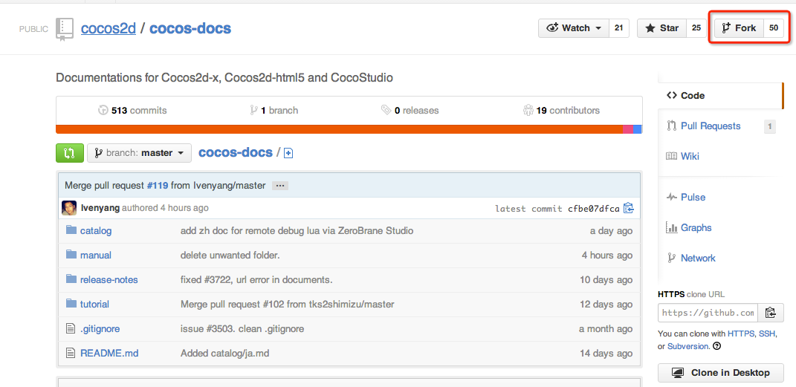

Then, clone the repo to your local repo by inputting following code in command line:

```
cd ~/workingspace
git clone https://github.com/cocos2d/cocos-docs.git
```

##Add repo to SourceTree

Open SourceTree and add a repo


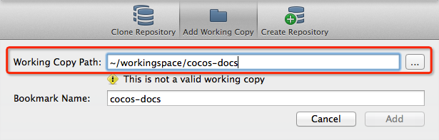

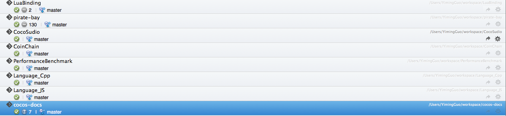

Then, you should create a remote repo in SourceTree to synchronize your repo from offical repo.

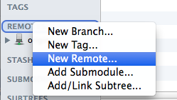

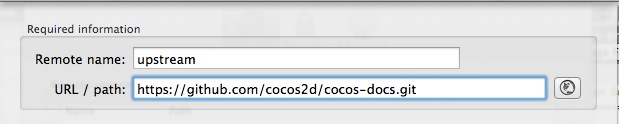

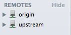

Now you can keep up with the official repo by `Pull from upstream`.

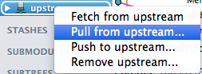

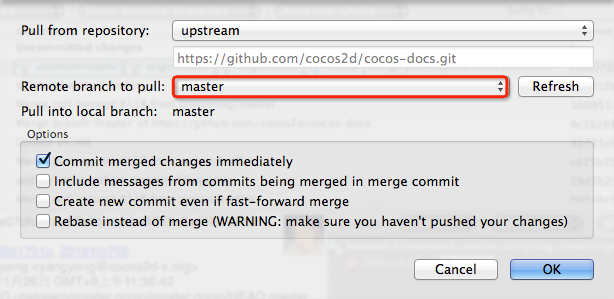

Push your local update to your Github repo.


##Add new doc and pull request

After you added new files in your local repo, add them to index and commit the change.

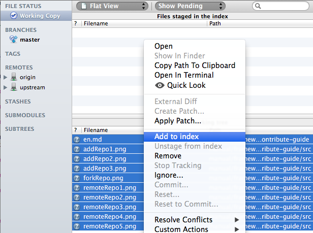

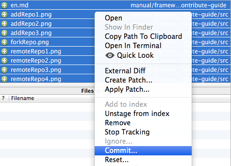

Now you can push the change in your remote repo on Github. 


One last thing, pull request for official repo on web page.

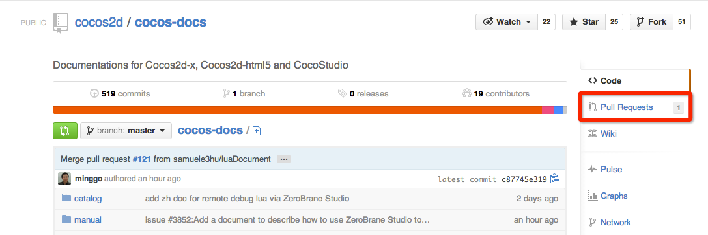

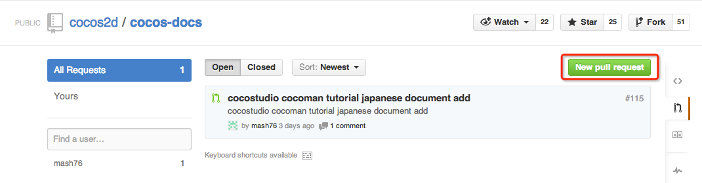

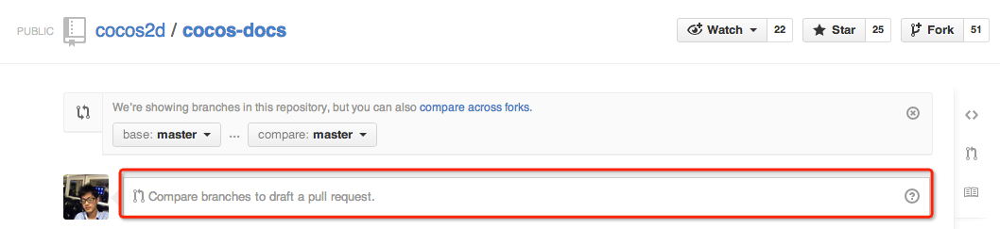
